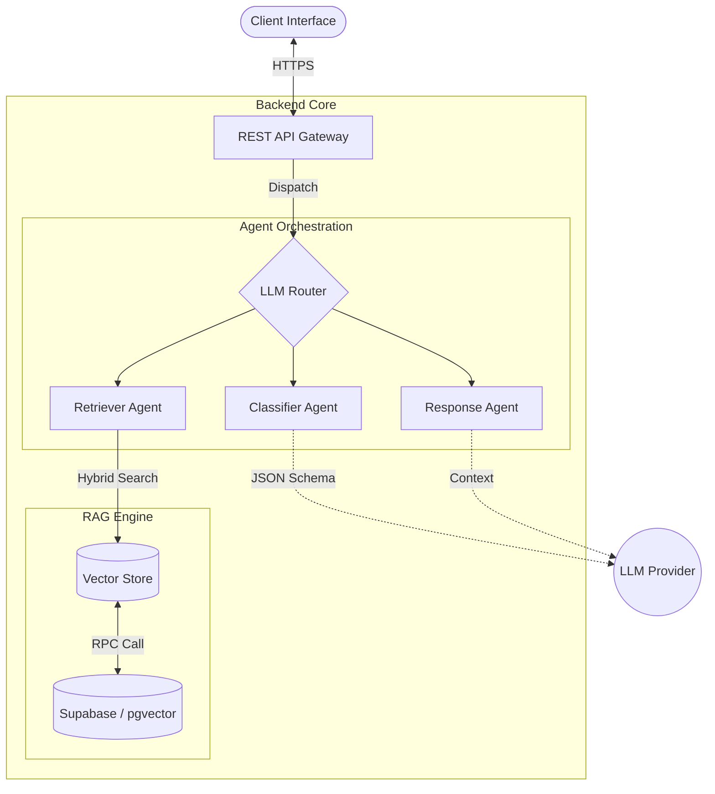

# AI Legal Aid Triage Agent ⚖️


**An intelligent, agentic legal triage system designed for the Indian Legal Context.**

This project leverages advanced **Retrieval-Augmented Generation (RAG)** and **Agentic AI** workflows to classify legal queries, retrieve relevant acts/sections, and provide preliminary legal guidance.

---

## � System Preview

| Dashboard | Chat Interface |
|:---------:|:--------------:|
|  |  |

---

## 🚀 Key Features

*   **🤖 Multi-Agent Orchestration**: Specialized agents for Classification, Information Retrieval, and Response Generation.
*   **📚 Legal-Specific RAG**:
    *   **Semantic Chunking**: Respects legal document structure (Sections, Chapters).
    *   **Hybrid Search**: Combines Scalar (Keyword) and Vector (Cosine Similarity) search via `pgvector`.
    *   **Query Expansion**: Automatically injects legal domain context into user queries.
*   **⚖️ Accurate Classification**: Uses Generative Few-Shot classification with fuzzy matching validation against a strict Indian Law taxonomy.
*   **🛡️ Robust Architecture**: Built on FastAPI with Pydantic validation, structured JSON outputs, and comprehensive error handling.
*   **💻 Modern Frontend**: Responsive React application built with Vite and Shadcn UI.

---

## 🏗️ Technical Architecture

### System Data Flow



For a deep dive into the algorithms and design patterns, see [TECHNICAL_ARCHITECTURE.md](Working/TECHNICAL_ARCHITECTURE.md).

---

## 🛠️ Tech Stack

### Backend
*   **Framework**: FastAPI
*   **Language**: Python 3.10+
*   **Orchestration**: LangChain Core
*   **Database**: Supabase (PostgreSQL + pgvector)
*   **Vector Embeddings**: Sentence Transformers / OpenAI

### Frontend
*   **Framework**: React (Vite)
*   **UI Library**: Shadcn UI + Tailwind CSS
*   **State Management**: React Context API
*   **Visuals**: Unicorn Studio, Framer Motion

---

## 📂 Project Structure

```bash
AI_Legal_Aid_Triage_Agent/
├── 📁 backend/                 # FastAPI Application
│   ├── 📁 app/
│   │   ├── 📁 agents/         # Clarity, Classifier, Retriever, etc.
│   │   ├── 📁 db/             # Supabase & Vector Store logic
│   │   ├── 📁 llm/            # Model Router (Gemini/OpenAI)
│   │   ├── 📁 rag/            # Chunking, Embedding, Retrieval pipelines
│   │   └── main.py            # App Entrypoint
│   └── 📁 scripts/            # Ingestion & Setup scripts
│
├── 📁 frontend/                # React Application
│   ├── 📁 src/
│   │   ├── 📁 components/     # UI Components (Shadcn)
│   │   ├── 📁 pages/          # Chat, Login, 404
│   │   └── 📁 hooks/          # Custom React Hooks
│
├── 📁 landing_page/            # Marketing Landing Page
└── 📁 Working/                 # Technical Documentation & Diagrams
```

---

## ⚡ Getting Started

### Prerequisites
*   Python 3.10+
*   Node.js 18+
*   Supabase Account

### 1. Backend Setup

```bash
cd backend

# Create virtual environment
python -m venv .venv
source .venv/bin/activate  # Windows: .venv\Scripts\activate

# Install dependencies
pip install -r requirements.txt

# Environment Setup
cp .env.example .env
# Edit .env with your Supabase credentials and API Keys
```

### 2. Frontend Setup

```bash
cd frontend

# Install dependencies
npm install

# Start Development Server
npm run dev
```

### 3. Database Initialization

```bash
cd backend
python scripts/setup_database.py
python scripts/ingest_documents.py  # Optional: Ingest sample data
```

---

## 📖 API Documentation

Once the backend is running, access the interactive API docs at:
*   **Swagger UI**: `http://localhost:8000/docs`
*   **ReDoc**: `http://localhost:8000/redoc`

---

## 🤝 Contribution

Contributions are welcome! Please fork the repository and submit a Pull Request.

1.  Fork the Project
2.  Create your Feature Branch (`git checkout -b feature/AmazingFeature`)
3.  Commit your Changes (`git commit -m 'Add some AmazingFeature'`)
4.  Push to the Branch (`git push origin feature/AmazingFeature`)
5.  Open a Pull Request

---

## 📄 License

Distributed under the MIT License. See `LICENSE` for more information.
