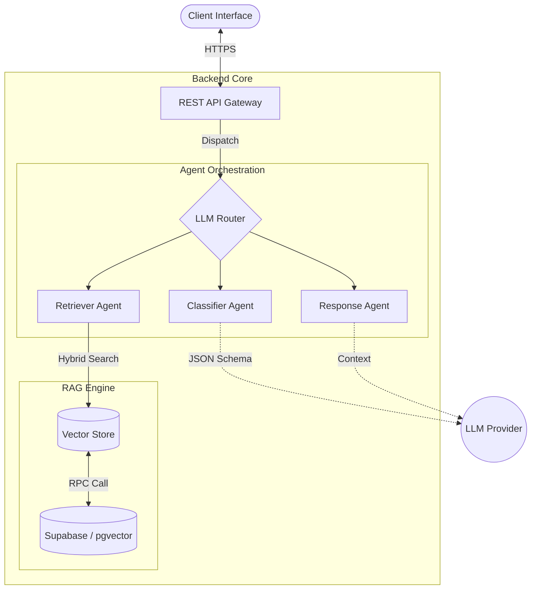

# Technical Architecture & Algorithms

## 1. System Architecture Overview

The AI Legal Aid Triage Agent utilizes a modular, agentic architecture built on a modern Python backend and React frontend. The system is designed to provide scalable, stateful, and domain-aware legal assistance.

### Tech Stack
- **Backend Framework**: FastAPI (Python 3.10+)
- **LLM Orchestration**: LangChain Core
- **Database**: Supabase (PostgreSQL)
- **Vector Store**: pgvector (via Supabase)
- **Frontend**: React (Shadcn UI)

### System Data Flow

---

## 2. Key Algorithms

### 2.1. Text Processing & Chunking
The system employs a **Hierarchical Semantic Chunking** algorithm (`TextChunker`) optimized for legal documents.

1.  **Semantic Segmentation**: 
    *   First, the algorithm scans for legal-specific Regex patterns (e.g., `Section \d+`, `CHAPTER [IVX]`, `Article \d+`) to respect document structure.
2.  **Sliding Window Fallback**:
    *   If semantic segmentation fails or chunks exceed the limit (`800 chars`), it falls back to a **Sliding Window** approach with overlap (`100 chars`).
3.  **Boundary Optimization**:
    *   The split point is not arbitrary; the algorithm utilizes a "Smart Break" heuristic (`_find_break_point`) that searches backwards from the cut limit to find natural delimiters in priority order:
        1.  Paragraph Breaks (`\n\n`)
        2.  Sentence Ends (`.!?`)
        3.  Whitespace (` `)
    *   *Purpose*: Preserves semantic integrity of legal clauses.

### 2.2. Retrieval (RAG) Logic
The RAG pipeline utilizes a **Hybrid Search** strategy.

*   **Vector Search Algorithm**:
    *   **Metric**: Cosine Similarity.
    *   **Implementation**: Utilizes PostgreSQL `pgvector` index (HNSW or IVFFlat) via a stored procedure `match_legal_chunks`.
*   **Query Expansion**:
    *   Pre-processing algorithm injects domain context into queries:
        *   $Q' = \{Domain\} + \{SubDomain\} + "procedure" + Q_{user}$
*   **Deduplication**:
    *   Implements an O(1) **Content Hashing** algorithm (hashing first 200 characters) to filter identical chunks retrieved from overlapping windows.

### 2.3. Classification Strategy
Uses a **Generative Few-Shot Classification** approach with algorithmic validation.

*   **Taxonomy Validation**:
    *   **Fuzzy Matching**: Post-classification, the system attempts to map LLM outputs to the canonical `LEGAL_DOMAINS` taxonomy.
    *   *Logic*: `if predicted_domain.lower() in canonical_domain.lower()`
    *   *Purpose*: Corrects minor hallucinations or casing mismatches from the LLM.
*   **Confidence Thresholding**:
    *   Hard gate: Returns "Unknown" if confidence < 0.7 (tuneable).

---

## 3. Design Patterns

### 3.1. Software Engineering Patterns
*   **Application Factory Pattern**: Used in `main.py` (`create_app`) to decouple application configuration from execution, facilitating testing and modular deployment.
*   **Repository Pattern**: Encapsulated in `VectorStore`. The business logic interacts with a clean interface (`add_documents`, `similarity_search`) rather than raw SQL.
*   **Strategy/Factory Pattern**: 
    *   Used in `llm/router.py`: `get_llm(provider)` dynamically instantiates the correct `BaseChatModel` adapter (Gemini, OpenRouter, OpenAI, etc.) based on runtime configuration.

### 3.2. AI/Agentic Patterns
*   **Orchestrator-Worker Pattern**:
    *   The system uses specialized "Worker" agents (`ClassifierAgent`, `RetrieverAgent`, `ResponseAgent`) orchestrated by a main control flow.
*   **Chain of Thought (CoT)**:
    *   Evident in System Prompts, instructing the model to "List missing fields" and provide "Reasoning" *before* the final output to improve accuracy.
*   **Structured Output Enforcement**:
    *   Agents are constrained to return valid JSON. The system implements robust parsing logic to strip Markdown code blocks and handle JSON errors gracefully.

### 3.3. Database Patterns
*   **RPC (Remote Procedure Call)**: Heavy computational logic (vector similarity) is offloaded to the database layer via PostgreSQL functions (`match_legal_chunks`), reducing data transfer latency.

---

## 4. API & Interface Design
*   **RESTful Architecture**: Resources (`chat`, `auth`, `sessions`) exposed via standard HTTP verbs.
*   **Dependency Injection**: Extensive use of FastAPI's `Depends` for managing database sessions and authentication context.
*   **Lifecycle Management**: `lifespan` context managers handle startup/cleanup tasks (DB connection, Logger setup).
